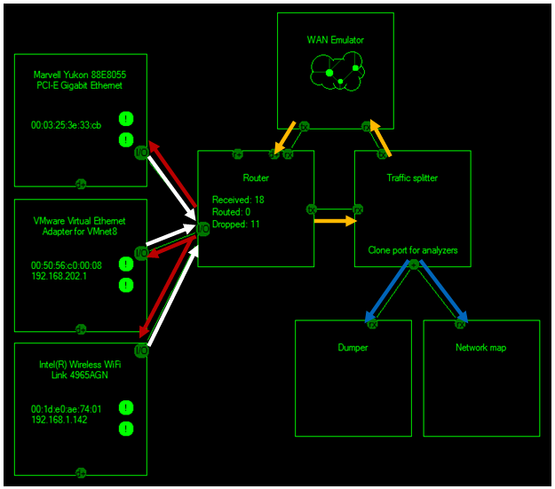

# Building an Extended Router

This tutorial builds upon the results of [Writing a Router](Writing-a-Router.md).

Adding new components to our router is easy. You just have to create the new traffic handles, then link them into the graph and update the shutdown routine. 

For example, add this code snippet below the code where you create and start your router:

```csharp
LibPcapDumper lcpDumper = new LibPcapDumper();
NetMap nmMap = new NetMap();
WANEmulator wanEmulator = new WANEmulator();

lcpDumper.Start();
nmMap.Start();
wanEmulator.Start();
```

The LibPcapDumper is a class which can dump [Frames](Frame) into a wireshark-readable format, the NetMap provides information about other hosts in the network and the WAN-Emulator simulates losses and errors that can happen in a WAN.

Let's get this some output from these components: 

```csharp
//Set traffic dumper properties
lcpDumper.StartLogging(Path.Combine(System.Environment.CurrentDirectory, "Dump " + 
 DateTime.Now.ToLongDateString()), false);

nmMap.HostInformationChanged += 
 new NetMap.HostChangedEventHandler(nmMap_HostInformationChanged);
 
static void nmMap_HostInformationChanged(HostInformationChangedEventArgs args, 
 object sender)
{
    Console.Write("Host found: " + args.Host.Name + " ");
    if (args.Host.IPAddresses.Count > 0)
    {
        Console.Write(args.Host.IPAddresses[0](0).ToString() + " ");
    }
    Console.WriteLine(args.Host.Type.ToString());
}

```

This will cause the dumper to start writing a dump file to the given path and the NetMap to notify us about the newest information about hosts in our network. 

The next step is to link the traffic handlers together accordingly. We have to set the WAN emulator as the output handler of the traffic splitter and the router as the output handler of the WAN emulator. Further we have to add the dumper and the network map to the analyzer list of the traffic splitter.

```csharp
//Let the router forward traffic from the interfaces to the traffic splitter
rRouter.OutputHandler = tsSplitter;
//Let the traffic splitter forward received traffic to the WAN emulator
tsSplitter.OutputHandler = wanEmulator;
//Let the WAN emulator forward received traffic back to the router
wanEmulator.OutputHandler = rRouter;
//Let the traffic splitter clone each frame and send it to the traffic dumper and the NetMap
tsSplitter.AddTrafficAnalyzer(nmMap),
tsSplitter.AddTrafficAnalyzer(lcpDumper);
```

Don't forget to add calls to the Cleanup() and Stop() methods for the LibPcapDumper, the WANEmualtor and the NetMap at the end of the program. 

Here is an image of the same setup build in NetLab, which can be useful for visualizing the graph: 



The arrows indicate the flow of the traffic. The traffic flows from the interface to the router (white arrows) and the router forwards the joined traffic streams to the traffic splitter (orange arrow) without modifying it. 

The traffic splitter then copies the frame once and forwards the copy to all attached analyzers (blue arrows). This is very important to protect against concurrent modification. Traffic analyzers must not modify any property of the frame, because the traffic splitter forwards the one cloned frame to all traffic splitter simultaneously and modifying a frame while another traffic splitter reads it could cause race conditions and serious program errors. 

The original instance will be forwarded to the next Traffic Handler connected to the out port of the traffic splitter, even if it is the router like in the first lesson. 

Because the frame is copied, the next Traffic Handler can modify the frame without impacting any of the traffic analyzers. 

The WAN emulator will then forward the frame to the router which will send it out to the according interface (white arrow). 

You can find the complete code and XNL file [here](../Examples/Extended-Router).

The next step is to implement custom [Traffic Handlers](Implementing-own-Traffic-Handlers.md) to actually access frame properties.