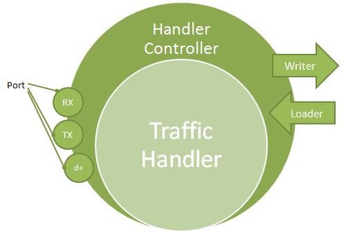

# Handler Controllers

Handler controllers implement the Interface `eExNLML.Extensibility.IHandlerController` and are responsible for managing [Traffic Handlers](Traffic-Hanlder.md) in the [NLML](eEx-NLML.md). The handler controller wraps the Traffic Handler's linking capabilities into [TrafficHandlerPorts](Ports.md). Furthermore, this class manages saving and loading of the TrafficHandlers properties and configuration. 

Handler controllers are in general created by the given [HandlerDefinition](HandlerDefinition.md).

# General Operation

Handler controllers provide various methods for managing handlers and to provide default settings and ports. There are also some methods which must be implemented by a deriving class, which are responsible for creating configuration loaders and writers, custom port information or the handler itself. 

All methods which create objects are called once, when the controller is created. A controller is created every time the user gives the command to instantiate a new handler. 

Handler controllers also provide information about the [ports](Ports.md) of a [Traffic Handler](Traffic-Handler.md). Traffic handlers are linked via ports. When a port signals an attach or detach event from another port, the controller checks if the call is valid and applies the action. 

## Example

* [Defining a NLML Plug-In](Defining-a-NLML-Plug-In)