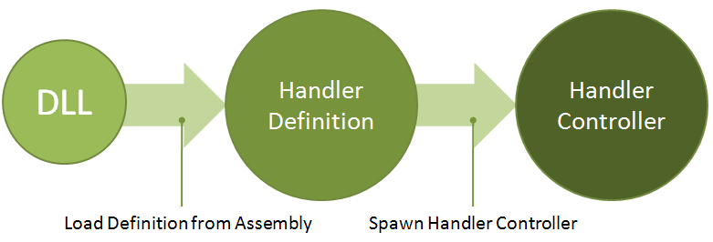

# Handler Definitions

Handler definitions implement the Interface `eExNLML.Extensibility.IHandlerDefinition`, which implements the Interface IPlugin and is responsible for instantiating [HandlerControllers](HandlerController) on demand and providing information about the plug-in. 

In short, handler definitions are plug-ins which instantiate handler controllers which wrap [Traffic Handlers](Traffic-Handler) into a management class. 

## General Operation

When loading a PlugIn from a Assembly, which declares itself as HandlerDefinition, the NLML [Compilation](Network-Compilation) checks the type of the plug-in against the type of `eExNLML.Extensibility.IHandlerDefinition`. If the types match, the plug-in is registered. 

When a file is loaded which contains the handler defined in this definition, or a handler is instantiated from this definition, the definition spawns a [HandlerController](HandlerController) which is inserted into the compilation.

## Network Interface Definitions

The `eExNLML.Extensibility.IInterfaceDefinition` is a special interface for creating handler definitions which define network interfaces. It includes the NetworkInterfaceType and the System GUID of the interface. 