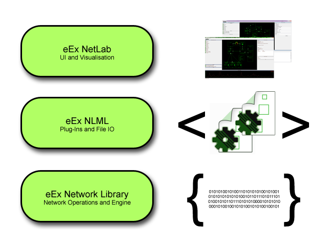

# Network Library Layer Architecture

In the architecture of the eEx Network Library, there are three layers, where each layer adds functionality to the layer below.

**Layer 1: Network Library**

The [Network Library](eEx-Network-Library.md) is the core of all networking operations. It provides several ways to modify and analyze network traffic, acessible directly from .NET code. It is important to know that the network library is organized mostly into [Traffic Handlers ](Traffic-Handler.md) or [Frames](Frame.md). They provide a object-oriented and flexible model for performing networking tasks. 

Accessing the Network Library from C# is the most straight-forward way of doing things. 

**Layer 2: NLML**

The [Network Library Management Layer](eEx-NLML.md) encapsulates objects of the Network Library so that they can be dynamically linked together. It provides provides mechanisms to load and save [network compilations](Network-Compilation) to [xml-based files](XNL-File), which can be shared and copied to other machines. The NLML also provides plug-in capability, and handles setup and shutdown of compilations. For this task, it [HandlerControllers](HandlerController) and [HandlerDefinitions](HandlerDefinition) for wrapping the Traffic Handlers provided by the Network Library.

**Layer 3: NetLab**

The [NetLab](eEx-NetLab) is a graphical user interface for the Network Library. It provides an UI to create and configure Traffic Handlers via point and click. All compilations can be saved and loaded into files. The NetLab uses [NetLabHandlerControllers](NetLabHandlerController) and [NetLabHandlerDefinitions](NetLabHandlerDefinition) for wrapping the controllers and definitions from the NLML and adding UI features.