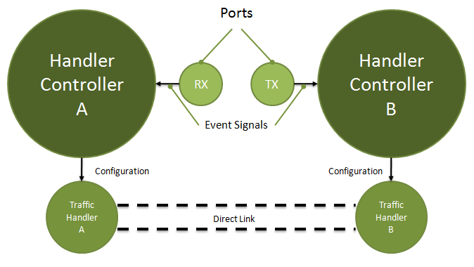

# The eExNLML.TrafficHandlerPort Class

The [NLML](eEx-NLML.md) uses traffic handler ports to make the various linking capabilities of [Traffic Handlers](Traffic-Handler.md) more dynamically manageable. 

## General Operation

Traffic handler ports provide a few properties, for example their name, description and an abbreviation. Furthermore, a port type is defined, which can be Input, Output, InterfaceIO or Interface. 
Whenever another port wants to connect to a port, both ports signal an attach event to the [HandlerController](HandlerController.md) which owns the ports. The controller checks whether the connection is valid and configures the traffic handlers. A detach event works the same way. The handlers itself are being connected directly - like as if they had been connected programmatically. 

For usual, you do not need to define your own ports. This is only needed if you want other ports than the default ports (Input, Output, DropAnalyzer, Interface, InterfaceIO) for your handler. 

## Default Ports

* **Input** (Traffic Handler in port) Provides capability to link the Traffic Handler to the output port of another Traffic Handler.
* **Output** (Traffic Handler out port) All output traffic is send to the handler connected to this port. 
* **DropAnalyzer** (Dropped traffic analyzer port) All frames dropped are send to the handler connected to this port. Only traffic analyzers can connect to this port. 
* **Interface** (Interface port) This port can be connected to all other Interface I/O ports and handles sending and receiving of traffic. All frames captured by the interface are sent to the handlers connected to this port. All traffic sent to this port is put on wire by the interface. Multiple handlers can connect to this port. Only Interfaces can create an Interface port. 
* **InterfaceIO** (InterfaceIO port) Port to connect interfaces to. Only Traffic Handlers which derive from DirectInterfaceIO can create an InterfaceIO port. 

**Notice**: For more information on specific ports of specific Traffic Handlers provided by the NLML or the NetLab, check the NetLab Wiki on [eex-dev.net](http://network.eex-dev.net/index.php?id=64&L=1)