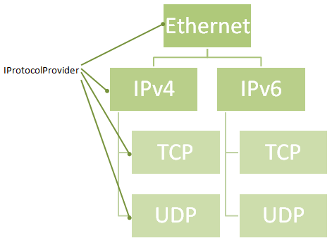

# Network Library Protocol Parsing Engine

The [Network Library](eEx-Network-Library.md) includes an extensible protocol parsing engine, which builds up a protocol map from given information and tries to parse [frames](Frame.md) only on demand. For example, if a traffic handler never requests a TCP frame, the TCP portion of each frame will always stay in raw format. Protocol parsing is strongly related to the [Frame](Frame.md) class, which is recommended reading for this topic. 

## General Operation



Protocols are provided by classes which implement the `eExNetworkLibrary.ProtocolParsing.IProtocolProvider` interface. All protocol providers define the protocol they are responsible for and which payloads are known by the carrier protocol, for example ICMP, TCP and UDP for IPv4 and IPv6. They also provide methods to parse the protocol itself and to get the payload type. 

A collection Protocol providers are used to construct an instance of the `eExNetworkLibrary.ProtocolParsing.ProtocolParser` class, which can be set for any traffic handler. Be careful to give each traffic handler it's own instance, or concurrency issues will occour. 

On creation, the ProtocolParser takes all given protocol providers and builds up a protocol mapping tree, as shown in the image above. If a protocol is requested for the frame, for example ethernet, the ProtocolParser will first search for already parsed frames with the requested type. If the frame is not found that way, the ProtocolParser will recursively search for the carrier protocol, check the payload type of the carrier protocol, and if the payload type matches the requested type, parse the payload to the requested frame and return it. 

**Notice on application layer protocols** This technique is useful for protocols up to transport layer. TCP payloads cannot be parsed this way, since the TCP payload is stream data. Traffic Handlers which analyze application protocols must provide these logic themselves or use [Network Library Sockets](Sockets).

**Notice on complex nested protocols** If a protocol relies on sub-protocols, for example IPv6 and the various IPv6 extension headers, you should define the sub-protocols as base classes of Frame, but let the protocol provider of the main protocol do all the parsing. This keeps the protocol tree smaller and avoids infinite loops in the tree. 

## Implemented ProtocolProviders

Protocol providers for the following protocols are implemented in the Network Library.

* ARP
* DHCP
* DNS
* Ethernet
* ICMPv4
* ICMPv6
 * ICMPv6 Neighbor Discovery
* IPv4
* IPv6
 * IPv6 Extension Headers
* OSPF
* TCP
* UDP

There exist enums for most standardized protocol types. For new protocols, it is highly recommended to use the defined value from the FrameTypes class if available. 

## Using Protocol Providers

Protocol Parsers are, for usual, used by the TrafficHandler to search for protocols.
Inside a TrafficHandler, for example when [overriding the HandleTraffic-Method](Implementing-own-Traffic-Handlers) the following calls can be used:

```csharp
// Gets the IP component of the input frame, or null, if no IP component is present.
eExNetworkLibrary.IP.IPFrame ipFrame = GetIPFrame(fInputFrame);
eExNetworkLibrary.IP.IPv4Frame ipv4Frame = GetIPv4Frame(fInputFrame);
eExNetworkLibrary.IP.V6.IPv6Frame ipv6Frame = GetIPv6Frame(fInputFrame); 

//This is also possible for TCP-Frames and so on
eExNetworkLibrary.TCP.TCPFrame tcpFrame = GetTCPFrame(fInputFrame);
```

The protocol engine also provides you the opportunity to search for protocols which are not statically defined, given that a protocol provider is installed for the given protocol.

```csharp
DNSFrame fDNSFrame = (DNSFrame)GetFrameByType(fInputFrame, FrameTypes.DNS);
DNSFrame fDNSFrame = (DNSFrame)GetFrameByType(fInputFrame, DNSFrame.DefaultFrameType);
DNSFrame fDNSFrame = (DNSFrame)GetFrameByType(fInputFrame, "DNS");
```

All three calls will lead to the same result. 