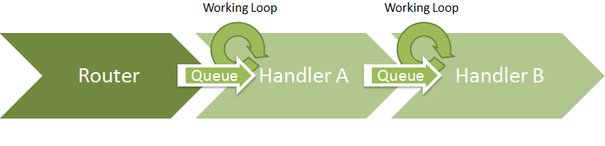

# Traffic Handlers

The `TrafficHandler` class is the main class in the network library. All networking functions, from network interfaces to the HTTP monitor, rely on this class. Traffic handlers can be coneccted together to build certain functionality.  

## General Operation

A Traffic Handler provides the following capabilities: 

* It has it's own working thread and implements ISynchronizeInvoke, so it ensures Thread Safety.
* It provides methods for [protocol parsing](Protocol-Engine), which means, you don't have to worry about parsing IP frames, TCP frames and so on at your own, if you want to implement your own traffic handler. 
* Each traffic handler can have an OutputHandler by default. All traffic which is handled by a traffic handler can be pushed forward to the output handler. 
* Frames which are received by a handler are pushed into a queue and handled one after one, so that only one traffic handler at a time is able to modify a frame. Also, a traffic handler can only have one output handler by default. This is necessary to eliminate concurrency issues. 

The linking of Traffic Handlers is abstracted by the [NLML](eEx-NLML), which uses [ports](Ports) to link together handlers. 

These graphs can be either build in code, or build and visualized by the NLML or Net Lab. 

## Special Handlers

In the network library, there are also some classes which derive from TrafficHandler but provide additional functionality. Examples are capability for simultaneous analysis, or the network interfaces, which support any number of output handlers.

##IPInterface

The IPInterface class provides an abstract base for interface implementations like the Ethernet interface. Interfaces are not supposed to use the OutputHandler, instead they provide a PacketCaptured event. When this event is invoked, each event handler receives a separate copy of the captured frame. This means, multiple handlers of the type DirectInterfaceIO can be attached to an IPInterface. 

##DirectInterfaceIO

The DirectInterfaceIO class is supposed to directly connect to interfaces. By default, this class has methods to add any number of interfaces and one output handler. Traffic is received from all interfaces and pushed to the output handler, and incoming traffic is pushed to all connected interfaces. This class is the base for handlers like routers or attacks which need direct access to network interfaces and their metadata. 

##TrafficAnalyzer

This class provides the capability of analyzing traffic in a parallel way. TrafficAnalyzers must not edit frames and they do not support output handlers. If you implement a class which does not modify traffic (examples are the LibPcap Dumper or the Network Map), you can use this class for a performance boost.

##TrafficSplitter

The traffic splitter is a support class for traffic analyzers. If you insert a traffic splitter into your network compilation, you can add analyzers to the splitter. All analyzers will receive the same copy of the frame simultaneously, which will have a positive impact on performance.  

**Notice**: For information about all handlers provided by the NLML or the NetLab, check the NetLab Wiki on [eex-dev.net](http://network.eex-dev.net/index.php?id=64&L=1).

## Further reading
* [Application Development](Application-Development.md)
* [Implementing own Traffic Handlers](Implementing-custom-Traffic-Handlers.md)
* [Handler graph and traffic flow](Extending-the-Router.md)
