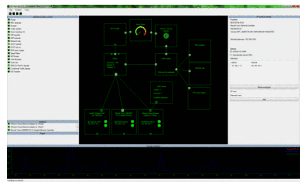

# The eEx NetLab

NetLab is a tool which enables the compilation of network functions via point and click on a graphical user interface. Drag and drop components like routers, network interface cards, network maps and much more from the toolbox to NetLab's workspace. There, the components can be configured and connected together. 
Even complex functions can be arranged and understood this way very easily, because all network traffic flowing through the NetLab is visualized and can be logged. All compilations can be saved to files and shared.

The NetLab [builds upon](Layer-Architecture.md) the [Network Library](eEx-Network-Library.md) and the [Network Library Management Layer](eEx-NLML.md). 

## Target audience of the NetLab

The NetLab was developed primary for educational purposes. It should help students  understand network operations. This task is accomplished by visualization and a easy-to use UI, which enables the user to accomplish powerful tasks with ease. 

## NetLab Wiki

A wiki page dedicated to the NetLab is provided at [eex-dev.net](http://network.eex-dev.net/index.php?id=64).